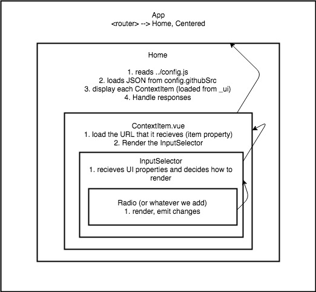

# reproschema-ui

[](https://travis-ci.org/ReproNim/schema-ui)

This repository contains the code for the user-interface for the [ReproSchema](https://github.com/ReproNim/reproschema).

See it in action [HERE](https://schema.repronim.org/ui/)

<!-- TOC -->

- [reproschema-ui](#reproschema-ui)
  - [List of supported input types](#list-of-supported-input-types)
    - [Text inputs](#text-inputs)
    - [Numerical values](#numerical-values)
    - [Audio inputs](#audio-inputs)
    - [Time and dates inputs](#time-and-dates-inputs)
    - [Multiple options inputs](#multiple-options-inputs)
    - [Others](#others)
  - [App architecture](#app-architecture)
  - [Reference material](#reference-material)
  - [Serve the app on your computer](#serve-the-app-on-your-computer)
    - [Install the dependencies](#install-the-dependencies)
    - [Serve the app locally](#serve-the-app-locally)
    - [Build for production with minification](#build-for-production-with-minification)
    - [Build for production and view the bundle analyzer report](#build-for-production-and-view-the-bundle-analyzer-report)
    - [Run unit tests](#run-unit-tests)
    - [Run e2e tests](#run-e2e-tests)
    - [Run all tests](#run-all-tests)

<!-- /TOC -->

## List of supported input types

The `inputType` is checked by `src/components/InputSelector/InputSelector.vue` which then calls the appropriate scrip from those listed in the folder `src/components/Inputs/`.

### Text inputs

-   text: `WebTextInput/TextInput.vue`
-   multitext: `MultiTextInput/MultiTextInput.vue`
-   email: `EmailInput/EmailInput.vue`

### Numerical values

-   number: `WebIntegerInput/IntegerInput.vue`
-   float:  `WebFloatInput/FloatInput.vue`

### Audio inputs

-   audioCheck: `AudioCheck/AudioCheck.vue`
-   audioRecord: `WebAudioRecord/Audio.vue`
-   audioPassageRecord: `WebAudioRecord/Audio.vue`
-   audioImageRecord: `WebAudioRecord/Audio.vue`
-   audioRecordNumberTask: `WebAudioRecord/Audio.vue`
-   audioAutoRecord: `AudioCheckRecord/AudioCheckRecord.vue`

### Time and dates inputs

-   date: `YearInput/YearInput.vue`
-   year: `YearInput/YearInput.vue`
-   timeRange: `TimeRange/TimeRange.vue`

### Multiple options inputs

-   radio: `WebRadio/Radio.vue`
-   slider: `SliderInput/SliderInput.vue`
-   select: `SelectInput/SelectInput.vue`
-   selectLanguage: `SelectInput/SelectInput.vue`
-   selectCountry: `SelectInput/SelectInput.vue`
-   selectState: `SelectInput/SelectInput.vue`

### Others

-   documentUpload: `DocumentUpload/DocumentUpload.vue`

<!-- MultiPart
StudySign
SaveData
Static
StaticReadOnly -->

<!-- ```
├── AudioCheck
├── AudioCheckRecord
├── DocumentUpload
├── EmailInput
├── MultiTextInput
├── SaveData
├── SelectInput
├── SliderInput
├── Static
├── StaticReadOnly
├── TimeRange
├── Utils
│   └── SelectImage
├── WebAudioRecord
├── WebFloatInput
├── WebIntegerInput
├── WebRadio
├── WebTextInput
└── YearInput
``` -->

## App architecture



## Reference material

This app use [Vue.js](https://vuejs.org/), a javascript framework.

Working on this will most likely require you to have some knowledge of HTML, CSS and javascript.

For some free introductory material to javascript you can check the [mozilla MDN](https://developer.mozilla.org/en-US/docs/Web/JavaScript) or the [W3 school](https://www.w3schools.com/js/default.asp).

For introductory material on Vue you can start by having a look at the [guide](https://vuejs.org/v2/guide/). For a more detailed explanation on how things work, check out the [guide](http://vuejs-templates.github.io/webpack/) and [docs for vue-loader](http://vuejs.github.io/vue-loader).

You can also find many non-free courses for all of the above on [udemy](https://www.udemy.com/) or similar MOOC services.

## Serve the app on your computer

If you want help us improve the app and work on it on your computer, you will need to [fork this repository](https://help.github.com/en/github/getting-started-with-github/fork-a-repo) and [clone it](https://help.github.com/en/github/creating-cloning-and-archiving-repositories/cloning-a-repository) on your machine.

To then run the app locally, you will have to install javascript `node.js`. A good way to do this, is to install [node version manager](https://github.com/nvm-sh/nvm) (NVM) to help you deal with different version of `node.js`.

If you are running linux, you can install NVM by typing:

```
curl -o- https://raw.githubusercontent.com/creationix/nvm/v0.33.11/install.sh | bash
```

Then close your terminal and reopen it then run the following to install the version 9 of `node.js`

```
nvm install node
nvm install 9
```

You should then be able to use node to the following:

### Install the dependencies
``` bash
npm install
```

### Serve the app locally
``` bash
npm run dev
```

This serves the app with hot reload at `localhost:8080`: in other words you will be able to see the app run if you open a browser and go to this URL [localhost:8080](localhost:8080).

### Build for production with minification
``` bash
npm run build
```

### Build for production and view the bundle analyzer report
``` bash
npm run build --report
```

### Run unit tests
``` bash
npm run unit
```

### Run e2e tests
``` bash
npm run e2e
```

### Run all tests
``` bash
npm test
```
